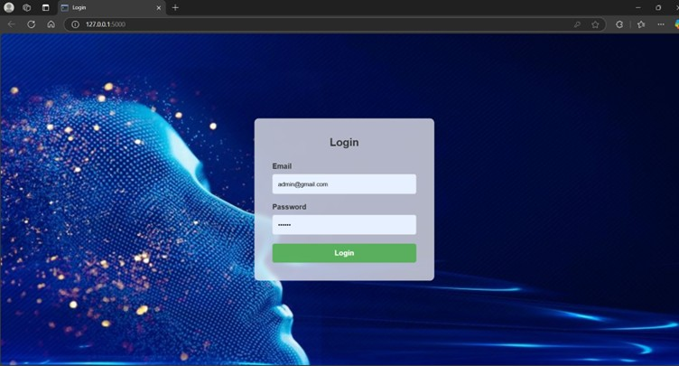
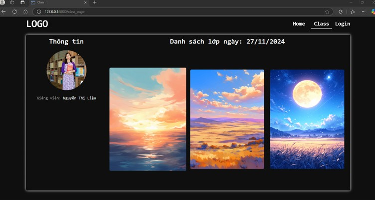
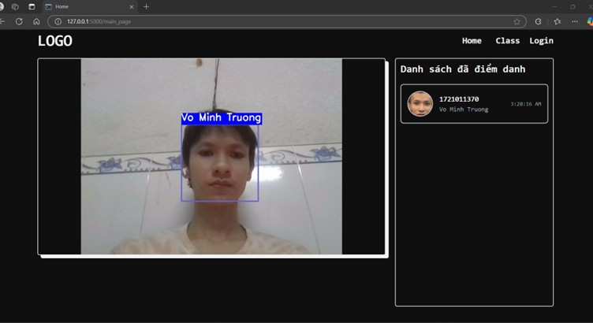
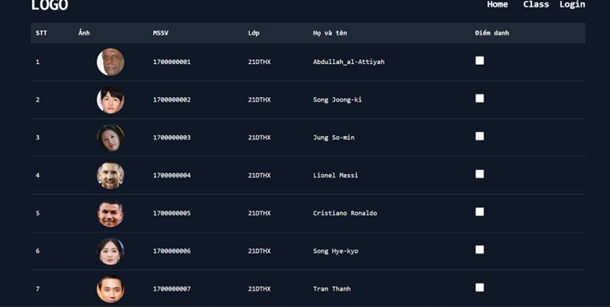

### Giao diện ứng dụng điểm danh bằng nhận diện khuôn mặt

#### 🔐 Trang đăng nhập
  
> Giao diện đăng nhập dành cho giảng viên với xác thực tài khoản trước khi truy cập hệ thống.

#### 🏫 Trang quản lý lớp học
  
> Danh sách các lớp mà giảng viên đang phụ trách, có thể chọn để xem thông tin sinh viên hoặc điểm danh.

#### 🏠 Điểm Danh
  
> Màn hình điểm danh, nơi giảng viên có thể điểm danh tự động hoặc thủ công.

#### 📋 Trang thông tin & điểm danh sinh viên
  
> Hiển thị thông tin chi tiết sinh viên trong lớp và trạng thái điểm danh theo từng buổi học.
